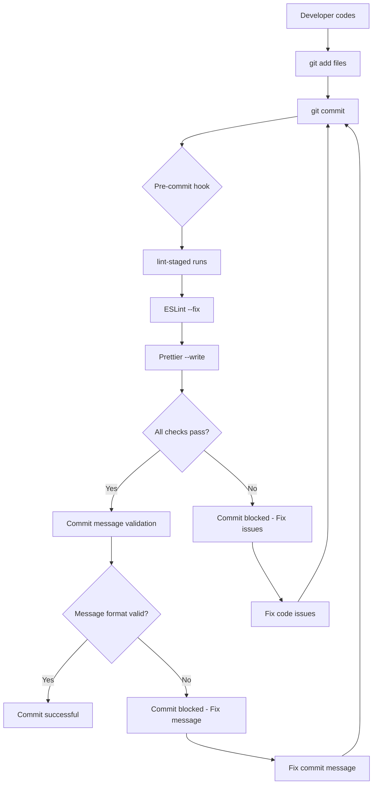

# Pre-commit Workflow Setup

This document explains the automated code quality workflow for TannenTails.

## 🎯 Overview

The project uses **Husky** and **lint-staged** to automatically run linting and formatting before each commit, ensuring consistent code quality.

## 🔧 Components

### 1. Husky Git Hooks
- **pre-commit**: Runs `lint-staged` on staged files
- **commit-msg**: Validates commit message format (conventional commits)

### 2. Lint-staged Configuration
Located in `package.json` under `lint-staged`:
```json
{
  "*.{ts,js}": [
    "eslint --fix",
    "prettier --write"
  ],
  "*.{html,scss,css,json}": [
    "prettier --write"
  ]
}
```

### 3. ESLint Configuration
- Angular-specific rules in `.eslintrc.json`
- Integrated with Prettier via `eslint-config-prettier`
- Automatically fixes issues when possible

### 4. Prettier Configuration
- Settings in `.prettierrc`
- Formats TypeScript, HTML, SCSS, and JSON files
- Consistent with Angular style guide

## 🚀 Commands

### Manual Commands
```bash
# Format all files
npm run format

# Check formatting
npm run format:check

# Lint with auto-fix
npm run lint:fix

# Standard lint
npm run lint
```

### Automatic Workflow
1. **Stage files**: `git add .`
2. **Commit**: `git commit -m "feat: add new feature"`
3. **Pre-commit hook runs automatically**:
   - ESLint fixes TypeScript/JavaScript issues
   - Prettier formats all staged files
   - If errors occur, commit is blocked
4. **Commit message validation**:
   - Must follow conventional commits format
   - Examples: `feat:`, `fix:`, `docs:`, `style:`, `refactor:`

## 📝 Commit Message Format

Follow [Conventional Commits](https://www.conventionalcommits.org/):

```
<type>(<scope>): <description>

[optional body]

[optional footer(s)]
```

### Examples:
- `feat(location): add GPS tracking functionality`
- `fix(ui): resolve station bar display issue`
- `docs: update README with setup instructions`
- `style: format code with prettier`
- `refactor(services): optimize location service performance`

### Types:
- `feat`: New feature
- `fix`: Bug fix
- `docs`: Documentation changes
- `style`: Code style changes (formatting, semicolons, etc.)
- `refactor`: Code refactoring
- `test`: Adding or updating tests
- `chore`: Maintenance tasks
- `perf`: Performance improvements
- `ci`: CI/CD changes
- `build`: Build system changes

## 🔍 What Gets Checked

### TypeScript/JavaScript Files (*.ts, *.js)
1. **ESLint Rules**:
   - Angular-specific linting rules
   - TypeScript best practices
   - Code quality and consistency
2. **Prettier Formatting**:
   - Consistent indentation (2 spaces)
   - Line length (100 characters)
   - Semicolons, quotes, trailing commas

### Template Files (*.html)
- **Prettier Formatting**:
  - Angular template formatting
  - Consistent indentation
  - Attribute ordering

### Style Files (*.scss, *.css)
- **Prettier Formatting**:
  - SCSS/CSS property ordering
  - Consistent indentation
  - Bracket spacing

### Configuration Files (*.json)
- **Prettier Formatting**:
  - JSON structure formatting
  - Consistent indentation

## ⚡ IDE Integration

### VS Code
Install these extensions for the best experience:
- **ESLint**: `ms-vscode.vscode-eslint`
- **Prettier**: `esbenp.prettier-vscode`
- **Angular Language Service**: `Angular.ng-template`

Configure VS Code settings:
```json
{
  "editor.formatOnSave": true,
  "editor.defaultFormatter": "esbenp.prettier-vscode",
  "eslint.alwaysShowStatus": true,
  "editor.codeActionsOnSave": {
    "source.fixAll.eslint": true
  }
}
```

## 🛠 Troubleshooting

### Pre-commit Hook Not Running
```bash
# Reinstall hooks
npm run prepare
# or
npx husky install
```

### ESLint Errors
```bash
# Auto-fix issues
npm run lint:fix

# Manual fix for complex issues
npm run lint
```

### Prettier Conflicts
```bash
# Format all files
npm run format

# Check specific files
npx prettier --check src/app/**/*.ts
```

### Bypass Hooks (Emergency Only)
```bash
# Skip pre-commit hook
git commit --no-verify -m "emergency fix"

# Skip commit message validation
git commit --no-verify -m "quick fix"
```

## 📊 Benefits

✅ **Consistent Code Style**: Automatic formatting ensures uniform code style  
✅ **Early Error Detection**: Catch issues before they reach the repository  
✅ **Better Collaboration**: Consistent formatting reduces diff noise  
✅ **Quality Assurance**: Enforce coding standards automatically  
✅ **Time Savings**: Automated formatting and linting reduce manual work  
✅ **Git History**: Clean, descriptive commit messages with conventional format  

## 🔄 Workflow Summary



This automated workflow ensures that every commit maintains high code quality standards! 🌲✨